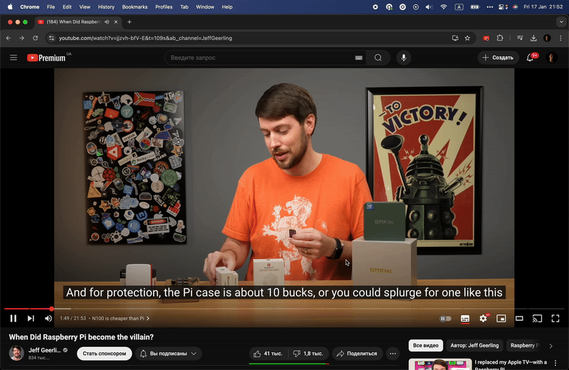
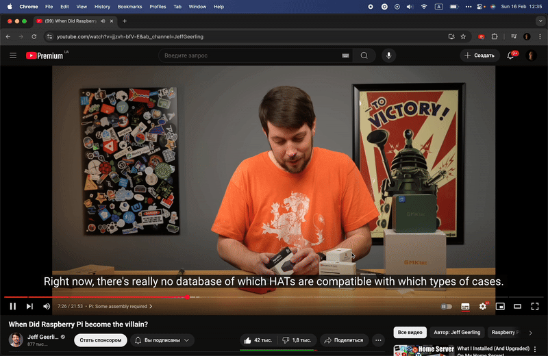

# HoverTranslate — YouTube subtitle translator for language learners

[](https://chromewebstore.google.com/detail/jbddomeagbjjdoaehkdffdhifdhnmfic)
[](https://chromewebstore.google.com/detail/jbddomeagbjjdoaehkdffdhifdhnmfic)
[](https://addons.mozilla.org/firefox/addon/hovertranslate/)
[](https://addons.mozilla.org/firefox/addon/hovertranslate/)
[](LICENSE)

HoverTranslate is a free, open-source browser extension for Chrome, Firefox and Edge that translates words in YouTube subtitles as you hover over them. It is made for people who learn a language from videos: point at a word you don't know, and its translation appears right above the subtitles, while the video waits for you.

**Install:** [Chrome Web Store](https://chromewebstore.google.com/detail/jbddomeagbjjdoaehkdffdhifdhnmfic) · [Firefox Add-ons](https://addons.mozilla.org/firefox/addon/hovertranslate/) · [Microsoft Edge Add-ons](https://microsoftedge.microsoft.com/addons/detail/emnbmkhbohfjmbkdipkppnbdlhgnhmhm)



## Why HoverTranslate

Most subtitle tools translate the whole line or show a second line of subtitles under the first. HoverTranslate does something smaller on purpose: it translates **the one word or phrase you point at**, so you still read the original and only look up what you actually don't know. No copying words into a translator, no switching tabs, no losing the thread.

## Features

- **Hover to translate.** Point at a word in the subtitles and its translation appears above it. Hold <kbd>Shift</kbd> and sweep across several words to translate a phrase or an idiom — or turn on "Always enable multiple selection" to do it without Shift.
- **Auto-pause.** The video pauses while the pointer is on the subtitles and plays on when you move away. You can turn this off.
- **Your own word list.** Click a word to save it together with its translation. Export the list as CSV or JSON to review your new words later, for example in a spreadsheet. A click can copy the word or its translation instead, if you prefer.
- **Auto-generated subtitles.** Works with the subtitles YouTube creates itself, so videos without subtitles from the creator work too.
- **Chinese, Japanese and Thai.** These languages are written without spaces between words, and HoverTranslate still picks out the single word under the pointer instead of translating the whole line (Chrome and Edge; Firefox 125 and newer).
- **Embedded players.** Works in YouTube videos embedded on other websites — blogs, online courses, news articles — not only on youtube.com.
- **More than 180 languages.** The subtitle language is detected automatically; you pick the language to translate into.
- **Google, Bing or DeepL.** Google works out of the box. Bing asks for access to <www.bing.com> the first time you pick it. DeepL works with your own free DeepL API key, which is stored only on your device and sent only to DeepL.
- **Context-aware translation with DeepL.** With DeepL, each word is translated in the context of its whole subtitle line, so a word with several meanings gets the one it has there: "bank" in "we sat on the bank of the river" is a riverbank, not a bank. The surrounding line is not counted against your DeepL allowance.
- **Looks like your subtitles.** The translation follows your YouTube subtitle style, or you can pick your own font, colors and size.



## Free and private

HoverTranslate is free: no account, no subscription, no ads, no analytics.

- The words you hover are sent only to the translator you chose (Google, Bing or DeepL) to be translated. With DeepL, the subtitle line around the word is sent too, for context.
- Your word list and the translation cache stay in your browser.
- Your settings are kept in your browser's storage and synced by your browser if you use its sync.
- A DeepL API key is stored only on your device.

The whole extension is open source under the [MIT License](LICENSE), so you can check all of this in the code.

## FAQ

**Does it work on Netflix or other video sites?**
No. HoverTranslate works on YouTube: on youtube.com and in YouTube players embedded on other websites. It does not support Netflix, Prime Video, Disney+ or other platforms.

**Does it show dual subtitles or translate the whole subtitle line?**
No. It translates the word or phrase under your pointer. The original subtitles stay as they are.

**Do I need a DeepL API key?**
Only if you want to use DeepL. Google works without any setup. DeepL's free API plan covers 500,000 characters a month; the key is free to create at [deepl.com/pro-api](https://www.deepl.com/pro-api).

**Which browsers are supported?**
Chrome and Edge 102 or newer, Firefox 115 or newer, on desktop. There is no mobile version.

**Are there known limitations?**

- Videos embedded in "privacy-enhanced mode" (`youtube-nocookie.com`) are not supported yet.
- In Firefox older than 125, Chinese, Japanese and Thai subtitle lines are translated as a whole rather than word by word.

## What's new

See the [changelog](CHANGELOG.md) for every release.

## Feedback

- Bug reports and feature requests: [GitHub Issues](https://github.com/kozii-d/hover-translate/issues)
- Email: <hovertranslate@gmail.com>

If HoverTranslate helps you learn, a rating in the [Chrome Web Store](https://chromewebstore.google.com/detail/jbddomeagbjjdoaehkdffdhifdhnmfic), on [Firefox Add-ons](https://addons.mozilla.org/firefox/addon/hovertranslate/) or on [Edge Add-ons](https://microsoftedge.microsoft.com/addons/detail/emnbmkhbohfjmbkdipkppnbdlhgnhmhm) helps other learners find it.

## Development

Three npm packages (`extension/`, `popup/` and the root), built with Vite and TypeScript; the popup uses React.

```bash
npm install && (cd extension && npm install) && (cd popup && npm install)
npm run setup:chrome   # or setup:edge / setup:firefox — picks the browser's manifest
npm run watch          # rebuilds on change
```

Then load the **repository root** as an unpacked extension (`chrome://extensions` → Developer mode → Load unpacked; in Firefox, `about:debugging` → Load Temporary Add-on → `manifest.json`).

`npm run build` makes a production build. Step-by-step build instructions, as used for the Firefox Add-ons review, are in [BUILD_INSTRUCTIONS.md](BUILD_INSTRUCTIONS.md).

## Acknowledgements

- [XTranslate](https://github.com/ixrock/XTranslate)
- [MouseTooltipTranslator](https://github.com/ttop32/MouseTooltipTranslator)
